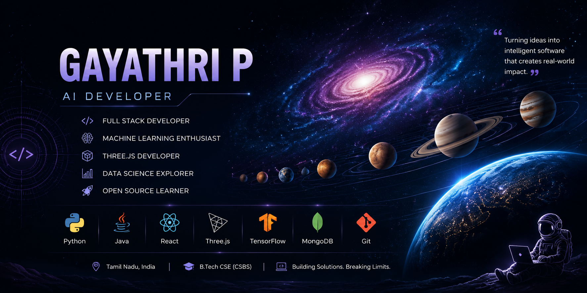

<p align="center">
  
</p>
# 📊 GitHub Statistics

<p align="center">


</p>
<p align="center">
  <a href="https://git.io/typing-svg">
    
  </a>
</p>
<h1 align="center">Hi 👋, I'm Gayathri P</h1>

<h3 align="center">
AI Developer • Full Stack Developer • Data Science Enthusiast
</h3>

<p align="center">
Building intelligent software, immersive 3D experiences, and AI-powered applications.
</p>

<p align="center">
Passionate about solving real-world problems through Artificial Intelligence, Machine Learning, Full Stack Development, and Computer Graphics.
</p>

---

# 👩‍💻 About Me

```python
class Gayathri:

    def __init__(self):

        self.name = "Gayathri P"

        self.role = "AI & Full Stack Developer"

        self.education = "B.Tech – Computer Science & Business Systems"

        self.college = "R.M.K Engineering College"

        self.location = "Tamil Nadu, India 🇮🇳"

        self.interests = [
            "Artificial Intelligence",
            "Machine Learning",
            "Data Science",
            "Three.js",
            "Full Stack Development",
            "Computer Vision",
            "Cloud Computing"
        ]

        self.currently_learning = [
            "Advanced Data Structures & Algorithms",
            "System Design",
            "Three.js",
            "Cloud Technologies"
        ]

        self.current_project = "SolarVerse"

        self.goal = "Building impactful software that solves real-world problems."
```

---

# 🚀 Current Focus

- 🌌 Developing **SolarVerse** — A cinematic 3D Solar System using Three.js.
- ☀️ Building AI-powered scientific applications.
- 💻 Strengthening Data Structures & Algorithms.
- 🌱 Learning advanced Full Stack Development.
- 🚀 Exploring scalable software architecture.

---

# 🚀 Featured Projects

## 🌌 SolarVerse

> A realistic cinematic 3D Solar System built using Three.js featuring NASA textures, realistic lighting, planetary motion, rings, moons, and immersive space visuals.

**Tech Stack**

- Three.js
- JavaScript
- WebGL
- HTML
- CSS
- Vite

---

## ☀️ SolarFlareX

> AI-powered Solar Flare Prediction Dashboard using NASA satellite data with visualization and forecasting.

**Tech Stack**

- Python
- Machine Learning
- Streamlit
- Pandas
- NumPy
- Scikit-learn

---

## 🛒 MERN E-Commerce

> Full Stack shopping platform with authentication, product management, wishlist, shopping cart, and responsive UI.

**Tech Stack**

- React
- Node.js
- Express
- MongoDB

---

## 🌿 Herbal Garden

> Interactive educational website providing medicinal plant information with responsive design.

---

# 🛠 Tech Stack

<p align="center">


</p>
---

## 🌐 Frontend

- HTML5
- CSS3
- React
- Three.js
- Bootstrap

---

## ⚙ Backend

- Node.js
- Express.js
- MongoDB
- REST APIs

---

## 🤖 Artificial Intelligence & Data Science

- TensorFlow
- Scikit-learn
- Pandas
- NumPy
- Matplotlib

---

## 🔧 Tools

- Git
- GitHub
- VS Code
- Postman
- Figma

---
# 🏆 Achievements

- 🏅 Oracle Certified Foundations Associate
- 📄 Presented research paper at AI-SDSC'25:
  "AI-Driven Energy Optimization in Manufacturing: A Case Study Using Linear Regression for Sustainable Industrial Efficiency"
- 🚀 Developed AI, Machine Learning, Full Stack, and 3D Web Applications
- 🛰️ Built SolarFlareX — AI-based Solar Flare Prediction System
- 🌌 Developing SolarVerse — Interactive 3D Solar System Experience
---

# 📚 Currently Learning

- Advanced Java
- Data Structures & Algorithms
- Machine Learning
- Three.js
- System Design
- Cloud Computing
- MERN Stack

---

# 📈 GitHub Goals (2026)

- ✅ Build impactful AI applications
- ✅ Contribute to Open Source
- ✅ Publish high-quality technical projects
- ✅ Master Full Stack Development
- ✅ Improve Competitive Programming skills
- ✅ Create portfolio-worthy software

---

# 🌐 Connect With Me

- 💼 LinkedIn
- 📧 Email
- 🌍 Portfolio
- 💻 LeetCode
- 🏆 GeeksforGeeks

---

# 💬 Favorite Quote

> "The best way to predict the future is to build it."

---

⭐ Thanks for visiting my profile!

If you like my work, consider giving a ⭐ to my repositories.

# 🐍 Contribution Snake

<p align="center">


</p>
